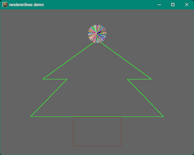

<!-- START doctoc generated TOC please keep comment here to allow auto update -->
<!-- DON'T EDIT THIS SECTION, INSTEAD RE-RUN doctoc TO UPDATE -->

- [sdl3_nim](#sdl3_nim)
  - [Install](#install)
  - [For Linux OS](#for-linux-os)
  - [For Windows11](#for-windows11)
  - [Build and run examples](#build-and-run-examples)
    - [Prerequisies](#prerequisies)
    - [Basic](#basic)
    - [Platformer with Dear ImGui](#platformer-with-dear-imgui)
    - [SdlApp_earth with Dear ImGui](#sdlapp_earth-with-dear-imgui)
    - [SdlApp_lines](#sdlapp_lines)
    - [ShowAnim with SDL_image](#showanim-with-sdl_image)
    - [Play multiple sounds with SDL_mixer](#play-multiple-sounds-with-sdl_mixer)
  - [SDL3 API document](#sdl3-api-document)
  - [About auto renaming](#about-auto-renaming)
  - [Development sdl3_nim](#development-sdl3_nim)
  - [My tools version](#my-tools-version)
  - [Other SDL game tutorial platfromer project](#other-sdl-game-tutorial-platfromer-project)
  - [Other examples project for Dear ImGui](#other-examples-project-for-dear-imgui)

<!-- END doctoc generated TOC please keep comment here to allow auto update -->

### sdl3_nim

---

SDL3 wrapper for Nim language with [futhark](https://github.com/PMunch/futhark#installation) converter.

- SDL3: 3.4.18 (2026/10)
- SDL_ttf:  3.2.2
- SDL_image
- SDL_mixer
- Windows OS 11 
- Linux Debian / Ubuntu families 


#### Install

---

First delete old version and install sdl3_nim 

```sh
nimble uninstall sdl3_nim
nimble refresh
nimble install   sdl3_nim 
```

#### For Linux OS

---

- If the package manager of the OS has **SDL-3.4.xx** and SDL_**ttf-3.3.2** packages,  
install them with the package manager
- Otherwise install them from source code as follows (on Debian / Ubuntu families),  
   1. Download source code from [SDL3](https://github.com/libsdl-org/SDL/archive/refs/tags/release-3.4.16.zip) and [SDL3_ttf](https://github.com/libsdl-org/SDL_ttf/archive/refs/tags/release-3#.2.2.zip)
   1. Install build tool **Ninja**

      ```sh
      sudo apt install ninja-build build-essential cmake
      ```

   1. Extract SDL3 zip file 
   
      ```sh
      cd SDL-release-3.4.16 
      mkdir build
      cd build 
      cmake .. -GNinja -DCMAKE_INSTALL_PREFIX=/usr/local
      ninja
      sudo ninja install
      sudo ldconfig
      ```

   1. Extract SDL3_ttf zip file
   
      ```sh
      cd SDL_ttf-release-3.2.2 
      mkdir build
      cd build 
      cmake .. -GNinja -DCMAKE_INSTALL_PREFIX=/usr/local
      ninja
      sudo ninja install
      sudo ldconfig
      ```

#### For Windows11

---

Download **SDL3 Dlls** from   
[SDL3-3.4.18](https://github.com/libsdl-org/SDL/releases/download/release-3.4.18/SDL3-3.4.18-win32-x64.zip)  
[SDL3_ttf-3.2.2](https://github.com/libsdl-org/SDL_ttf/releases/download/release-3.2.2/SDL3_ttf-3.2.2-win32-x64.zip)  
[SDL3_image-3.4.6](https://github.com/libsdl-org/SDL_image/releases/download/release-3.4.6/SDL3_image-3.4.6-win32-x64.zip)  
[SDL3_mixer-3.2.4](https://github.com/libsdl-org/SDL_mixer/releases/download/release-3.2.4/SDL3_mixer-3.2.4-win32-x64.zip)    
then copy them to your application folder.

#### Build and run examples

---

##### Prerequisies 

---

```sh
git clone https://github.com/dinau/sdl3_nim
```

- Windows11
[MSys2/MinGW installed](https://www.msys2.org/): Command line tools: make, cp, rm, git, ...etc

   ```sh
   pacman -S mingw-w64-ucrt-x86_64-{gcc,sdl3,pkgconf,ninja} make cmake
   ```

- Linux: Debian / Ubuntu families 

   ```sh
   $ sudo apt install build-essential pkgconf
   $ sudo apt install lib{opengl-dev,gl1-mesa-dev,xcursor-dev,xinerama-dev,xi-dev,sdl3-ttf-dev,sdl3-image-dev} git ninja-build cmake
   ```

##### Basic
  
---

[basic.nim](examples/basic/basic.nim)

- Desktop application

   ```sh
   cd examples/basic
   make app
   ./basic.exe
   ```
 
   

[^emsdk_list]: `$ emsdk list`  # Show version list

#####  Platformer with Dear ImGui

---

Live demo: [Click here](https://dinau.github.io/sdl3_nim/examples/wasm/platformer/wasm)
   


[platformer.nim](examples/platformer/platformer.nim)

Currently on Windows only

- Install [ImGuin](https://github.com/dinau/imguin)
   ```sh
   nimble install imguin basic2d
   ```

- Desktop application with [Dear ImGui](https://github.com/ocornut/imgui)  
Copy `SDL3.dll`, `SDL3_mixer.dll` and `SDL3_ttf.dll` to `examples/platformer` folder

   ```sh
   cd examples/platformer
   make app
   ./platformer.exe
   ```

- WebGL/Wasm application with Dear ImGui

   1. [Install emscripten](https://emscripten.org/docs/getting_started/downloads.html#installation-instructions-using-the-emsdk-recommended)
   1. Specify emsdk **6.0.9**[^emsdk_list]
   
      ```sh
      emsdk install  6.0.9 
      emsdk activate 6.0.9
      ```
   
   1. Go to `examples/platformer` folder

   1. Run `emsdk_env.bat`(Windows) or `emsdk_env.sh`(Linux) in your console
      > [!IMPORTANT]
   
      ```sh
      emsdk_env.bat     # Run this once in every new console
      ```

   1. Build Wasm and run

      ```sh
      make lib  # It will take very long time.
      make run
      ```

##### SdlApp_earth with Dear ImGui

---

Live demo: [Click here](https://dinau.github.io/sdl3_nim/examples/sdlapp_earth/wasm)

[sdlapp_earth.nim](examples/sdlapp_earth/sdlapp_earth.nim)

- Desktop application

   ```sh
   cd examples/sdlapp_earth
   make app
   ./sdlapp_earth.exe
   ```
   
- WebGL/Wasm application 

   - Build Wasm and run  
      Same as platformer demo except `make lib`

      ```sh
      cd examples/sdlapp_earth
      make run
      ```
      
      

##### SdlApp_lines

---

[sdlapp_lines.nim](examples/sdlapp_lines/sdlapp_lines.nim)

- Desktop application

   ```sh
   cd examples/sdlapp_lines
   make app
   ./sdlapp_lines.exe
   ```

- WebGL/Wasm application

   - Build Wasm and run  
      Same as platformer demo except `make lib`

      ```sh
      cd examples/sdlapp_lines
      make run
      ```

      Refer to https://github.com/libsdl-org/SDL/tree/main/examples/renderer/03-lines
      
      

##### ShowAnim with SDL_image

---

[showanim.nim](examples/showanim/showanim.nim)

Windows11 : Copy `SDL3.dll`, and `SDL3_image.dll` to `examples/showanim` folder

```sh
cd examples/showanim
make run  # or run_demo.bat
```

You can use left arrow key to view next image.

##### Play multiple sounds with SDL_mixer

---

[play_multiple_sounds.nim](examples/play_multiple_sounds/play_multiple_sounds.nim)

Windows11 : Copy `SDL3.dll`, and `SDL3_mixer.dll` to `examples/play_multiple_sounds` folder

```sh
cd examples/play_multiple_sounds
make run  
```

This program is converted from  
https://github.com/libsdl-org/SDL_mixer/tree/main/examples/basics/03-play-multiple-sounds

#### SDL3 API document

---

[x] https://wiki.libsdl.org/SDL3/FrontPage  
[x] https://wiki.libsdl.org/SDL3_ttf/FrontPage  
[x] https://wiki.libsdl.org/SDL3_image/FrontPage  
[x] https://wiki.libsdl.org/SDL3_mixer/FrontPage  


Except for the auto-renamed items listed below,   
the definition and function names are essentially identical to those in the original document above,  
so please refer to that for details.

[x] [Nim definition file of SDL3](src/sdl3_nim/sdl3_defs.nim)   
[x] [Nim definition file of SDL3_ttf](src/sdl3_nim/sdl3_ttf_defs.nim)  
[x] [Nim definition file of SDL3_image](src/sdl3_nim/sdl3_image_defs.nim)  
[x] [Nim definition file of SDL3_mixer](src/sdl3_nim/sdl3_mixer_defs.nim) 


#### About auto renaming 

---

Notice: [Futhark](https://github.com/PMunch/futhark) converter has automatically renamed these symbols.

```nim
Renaming "SDL_PRIX64" to "SDL_PRIX64_const" [User]
Renaming "SDL_PRIX32" to "SDL_PRIX32_const" [User]
Renaming "SDLK_MEDIASELECT" to "SDLK_MEDIASELECT_const" [User]
Renaming "SDLK_a" to "SDLK_a_const" [User]
Renaming "SDLK_b" to "SDLK_b_const" [User]
Renaming "SDLK_c" to "SDLK_c_const" [User]
Renaming "SDLK_d" to "SDLK_d_const" [User]
Renaming "SDLK_e" to "SDLK_e_const" [User]
Renaming "SDLK_f" to "SDLK_f_const" [User]
Renaming "SDLK_g" to "SDLK_g_const" [User]
Renaming "SDLK_h" to "SDLK_h_const" [User]
Renaming "SDLK_i" to "SDLK_i_const" [User]
Renaming "SDLK_j" to "SDLK_j_const" [User]
Renaming "SDLK_k" to "SDLK_k_const" [User]
Renaming "SDLK_l" to "SDLK_l_const" [User]
Renaming "SDLK_m" to "SDLK_m_const" [User]
Renaming "SDLK_n" to "SDLK_n_const" [User]
Renaming "SDLK_o" to "SDLK_o_const" [User]
Renaming "SDLK_p" to "SDLK_p_const" [User]
Renaming "SDLK_q" to "SDLK_q_const" [User]
Renaming "SDLK_r" to "SDLK_r_const" [User]
Renaming "SDLK_s" to "SDLK_s_const" [User]
Renaming "SDLK_t" to "SDLK_t_const" [User]
Renaming "SDLK_u" to "SDLK_u_const" [User]
Renaming "SDLK_v" to "SDLK_v_const" [User]
Renaming "SDLK_w" to "SDLK_w_const" [User]
Renaming "SDLK_x" to "SDLK_x_const" [User]
Renaming "SDLK_y" to "SDLK_y_const" [User]
Renaming "SDLK_z" to "SDLK_z_const" [User]
Renaming "SDL_SensorUpdate" to "SDL_SensorUpdate_const" [User]
Renaming "SDL_strtok_r" to "SDL_strtok_r_proc" [User]
Renaming "SDL_ThreadID" to "SDL_ThreadID_typedef" [User]
Renaming "SDL_Mutex" to "SDL_Mutex_typedef" [User]
Renaming "SDL_GLAttr" to "SDL_GLAttr_typedef" [User]
Renaming "SDL_GLProfile" to "SDL_GLProfile_typedef" [User]
Renaming "SDL_GLContextFlag" to "SDL_GLContextFlag_typedef" [User]
Renaming "SDL_GLContextReleaseFlag" to "SDL_GLContextReleaseFlag_typedef" [User]
Renaming "SDL_WindowEvent" to "SDL_WindowEvent_typedef" [User]
Renaming "SDL_UserEvent" to "SDL_UserEvent_typedef" [User]
Renaming "SDL_EventAction" to "SDL_EventAction_typedef" [User]
Renaming "SDL_Quit" to "SDL_Quit_proc" [User]
Renaming "SDL_Log" to "SDL_Log_proc" [User]
Renaming "PRIX32" to "PRIX32_const" [User]
Renaming "func" to "func_arg" [User]
Renaming "type" to "type_field" in struct_SDL_AsyncIOOutcome [User]
Renaming "ptr" to "ptr_arg" [User]
Renaming "SDL_SCALEMODE_NEAREST" to "SDL_SCALEMODE_NEAREST_enumval" [User]
Renaming "SDL_SCALEMODE_LINEAR" to "SDL_SCALEMODE_LINEAR_enumval" [User]
Renaming "SDL_GL_CONTEXT_RESET_NOTIFICATION" to "SDL_GL_CONTEXT_RESET_NOTIFICATION_enumval" [User]
Renaming "proc" to "proc_arg" [User]
Renaming "type" to "type_arg" [User]
Renaming "type" to "type_field" in struct_SDL_VirtualJoystickSensorDesc [User]
Renaming "type" to "type_field" in struct_SDL_VirtualJoystickDesc [User]
Renaming "type" to "type_arg" [User]
Renaming "SDL_SCANCODE_MEDIA_SELECT" to "SDL_SCANCODE_MEDIA_SELECT_enumval" [User]
Renaming "type" to "type_field" in struct_SDL_CommonEvent [User]
Renaming "type" to "type_field" in struct_SDL_DisplayEvent [User]
Renaming "type" to "type_field" in struct_SDL_WindowEvent [User]
Renaming "type" to "type_field" in struct_SDL_KeyboardDeviceEvent [User]
Renaming "type" to "type_field" in struct_SDL_KeyboardEvent [User]
Renaming "mod" to "mod_field" in struct_SDL_KeyboardEvent [User]
Renaming "type" to "type_field" in struct_SDL_TextEditingEvent [User]
Renaming "type" to "type_field" in struct_SDL_TextEditingCandidatesEvent [User]
Renaming "type" to "type_field" in struct_SDL_TextInputEvent [User]
Renaming "type" to "type_field" in struct_SDL_MouseDeviceEvent [User]
Renaming "type" to "type_field" in struct_SDL_MouseMotionEvent [User]
Renaming "type" to "type_field" in struct_SDL_MouseButtonEvent [User]
Renaming "type" to "type_field" in struct_SDL_MouseWheelEvent [User]
Renaming "type" to "type_field" in struct_SDL_JoyAxisEvent [User]
Renaming "type" to "type_field" in struct_SDL_JoyBallEvent [User]
Renaming "type" to "type_field" in struct_SDL_JoyHatEvent [User]
Renaming "type" to "type_field" in struct_SDL_JoyButtonEvent [User]
Renaming "type" to "type_field" in struct_SDL_JoyDeviceEvent [User]
Renaming "type" to "type_field" in struct_SDL_JoyBatteryEvent [User]
Renaming "type" to "type_field" in struct_SDL_GamepadAxisEvent [User]
Renaming "type" to "type_field" in struct_SDL_GamepadButtonEvent [User]
Renaming "type" to "type_field" in struct_SDL_GamepadDeviceEvent [User]
Renaming "type" to "type_field" in struct_SDL_GamepadTouchpadEvent [User]
Renaming "type" to "type_field" in struct_SDL_GamepadSensorEvent [User]
Renaming "type" to "type_field" in struct_SDL_AudioDeviceEvent [User]
Renaming "type" to "type_field" in struct_SDL_CameraDeviceEvent [User]
Renaming "type" to "type_field" in struct_SDL_RenderEvent [User]
Renaming "type" to "type_field" in struct_SDL_TouchFingerEvent [User]
Renaming "type" to "type_field" in struct_SDL_PinchFingerEvent [User]
Renaming "type" to "type_field" in struct_SDL_PenProximityEvent [User]
Renaming "type" to "type_field" in struct_SDL_PenMotionEvent [User]
Renaming "type" to "type_field" in struct_SDL_PenTouchEvent [User]
Renaming "type" to "type_field" in struct_SDL_PenButtonEvent [User]
Renaming "type" to "type_field" in struct_SDL_PenAxisEvent [User]
Renaming "type" to "type_field" in struct_SDL_DropEvent [User]
Renaming "type" to "type_field" in struct_SDL_ClipboardEvent [User]
Renaming "type" to "type_field" in struct_SDL_SensorEvent [User]
Renaming "type" to "type_field" in struct_SDL_QuitEvent [User]
Renaming "type" to "type_field" in struct_SDL_UserEvent [User]
Renaming "type" to "type_field" in union_SDL_Event [User]
Renaming "type" to "type_arg" [User]
Renaming "type" to "type_field" in struct_SDL_PathInfo [User]
Renaming "type" to "type_field" in struct_SDL_GPUTextureCreateInfo [User]
Renaming "type" to "type_arg" [User]
Renaming "type" to "type_field" in struct_SDL_HapticDirection [User]
Renaming "type" to "type_field" in struct_SDL_HapticConstant [User]
Renaming "type" to "type_field" in struct_SDL_HapticPeriodic [User]
Renaming "type" to "type_field" in struct_SDL_HapticCondition [User]
Renaming "type" to "type_field" in struct_SDL_HapticRamp [User]
Renaming "end" to "end_field" in struct_SDL_HapticRamp [User]
Renaming "type" to "type_field" in struct_SDL_HapticLeftRight [User]
Renaming "type" to "type_field" in struct_SDL_HapticCustom [User]
Renaming "type" to "type_field" in union_SDL_HapticEffect [User]
Renaming "block" to "block_arg" [User]
```

#### Development sdl3_nim

---

Generating SDL3 Nim header files with Futhark.

[The definition file of SDL3](src/sdl3_nim/sdl3_defs.nim) can be updated by yourself as follows, 

1. Replace [src/private/SDL3](src/sdl3_nim/private/SDL3) with  [latest officail SDL3 library](https://github.com/libsdl-org/SDL/releases)
1. [Install Futhark](https://github.com/PMunch/futhark#installation)
1. Edit `src/sdl3_nim.nim`  
   Specifiy your Clang include folder

   ```sh
   const ClangIncludePath = "c:/msys64/ucrt64/lib/clang/22/include"
   or 
   const ClangIncludePath = "c:/msys64/ucrt64/opt/llvm-21/include" so on
   ```

1. Generate definition file

   ```sh
   pwd 
   sdl3_nim
   make gen
   ```

   `src/sdl3_nim/sdl3_defs.nim` updated will be generated.

#### My tools version 

---

- Futhark 0.16.0
- nim-2.2.12
- Gcc.exe (Rev2, Built by MSYS2 project) 16.1.0

#### Other SDL game tutorial platfromer project

---


| Language             |          | SDL         | Project                                                                                                                                               |
| -------------------: | :---:    | :---:       | :----------------------------------------------------------------:                                                                                    |
| **LuaJIT**           | Script   | SDL2        | [LuaJIT-Platformer](https://github.com/dinau/luajit-platformer)                                                                                       |
| **Nelua**            | Compiler | SDL2        | [NeLua-Platformer](https://github.com/dinau/nelua-platformer)                                                                                         |
| **Nim**              | Compiler | SDL3 / SDL2 | [Nim-Platformer-sdl2](https://github.com/def-/nim-platformer)/ [Nim-Platformer-sdl3](https://github.com/dinau/sdl3_nim/tree/main/examples/platformer) |
| **Ruby**             | Script   | SDL3        | [Ruby-Platformer](https://github.com/dinau/ruby-platformer)                                                                                           |
| **Zig**              | Compiler | SDL3 / SDL3 | [Zig-Platformer](https://github.com/dinau/zig-platformer)                                                                                             |


#### Other examples project for Dear ImGui

---

| Language             |          | Project                                                                                                                                         |
| -------------------: | :---:    | :----------------------------------------------------------------:                                                                              |
| **Lua**              | Script   | [LuaJITImGui](https://github.com/dinau/luajitImGui)                                                                                             |
| **NeLua**            | Compiler | [NeLuaImGui](https://github.com/dinau/neluaImGui) / [NeLuaImGui2](https://github.com/dinau/neluaImGui2)                                         |
| **Nim**              | Compiler | [ImGuin](https://github.com/dinau/imguin), [Nimgl_test](https://github.com/dinau/nimgl_test), [Nim_implot](https://github.com/dinau/nim_implot) |
| **Python**           | Script   | [DearPyGui for 32bit WindowsOS Binary](https://github.com/dinau/DearPyGui32/tree/win32)                                                         |
| **Ruby**             | Script   | [igRuby_Examples](https://github.com/dinau/igruby_examples)                                                                                     |
| **Zig**, C lang.     | Compiler | [Dear_Bindings_Build](https://github.com/dinau/dear_bindings_build)                                                                             |
| **Zig**              | Compiler | [ImGuinZ](https://github.com/dinau/imguinz)                                                                                                     |


https://kenney.nl/assets  
https://opengameart.org/content/overworld-theme-0  platformer.wav    
https://opengameart.org/content/female-rpg-voice-starter-pack 
https://opengameart.org/content/happy-plains  

https://opengameart.org/content/fun-background  
https://opengameart.org/content/it-lies-ahead  
https://opengameart.org/content/flowerbed-fiel-loop  
https://opengameart.org/content/4-chiptunes-adventure  
https://opengameart.org/content/fun-in-the-wood  
https://opengameart.org/content/osiris-megalith  
https://opengameart.org/content/retroturnaroundstage-1-remix 
https://opengameart.org/content/speedway  
https://opengameart.org/content/red-heels-piano-ver  
